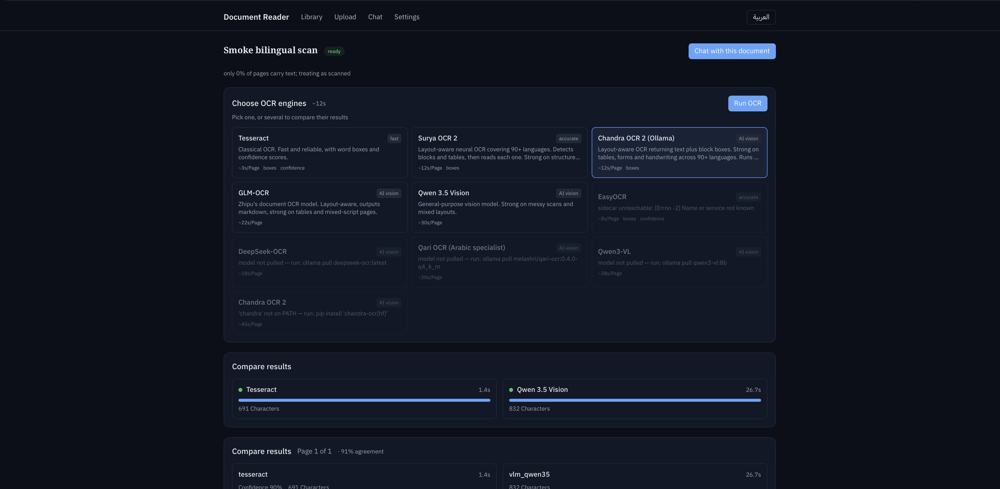
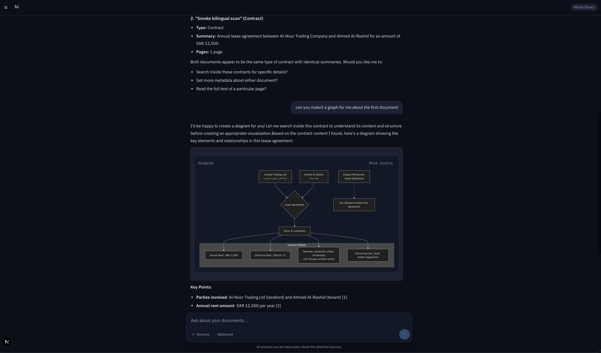
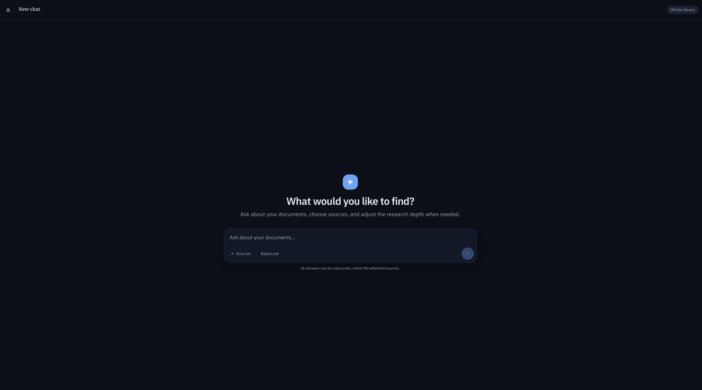

# OCR + Agentic RAG — Arabic & English

Upload a document → run several OCR engines side by side → pick the best result →
edit it yourself or have AI correct it → get structured metadata → chat with it.

Built for **bilingual Arabic/English documents**, where a single page mixes both
scripts and most OCR pipelines quietly fall apart. Runs entirely on your own
machine: fully dockerized, no cloud API keys. Ollama runs on the host
so it gets the GPU; everything else is a container.



---

## What it does

**Compare OCR engines instead of trusting one.** Ten engines are registered —
classical (Tesseract), layout-aware neural (Surya OCR 2, Chandra OCR 2), and
vision LLMs (Qwen 3.5 Vision, Qwen3-VL, DeepSeek-OCR, GLM-OCR, Qari). Pick one or
several; the app shows per-engine timing, character counts, confidence and a
page-by-page agreement score, so you choose a baseline on evidence.

Engines that aren't available are greyed out **with the reason** — model not
pulled, binary not on PATH, sidecar unreachable — and the exact command to fix it.

**Edit without losing the original.** Raw OCR output is immutable. Every edit
creates a new revision with a parent pointer, so you can always get back to what
the engine actually produced.

**AI correction that can't hallucinate a new document.** The "improve" feature is
the easiest way to quietly ruin an OCR product, so it's guarded in five layers —
see [Anti-hallucination](#anti-hallucination) below.

**Structured metadata.** Document type, dates (including Hijri → Gregorian
conversion), reference numbers, amounts in both Arabic-Indic and Western digits,
and typed custom fields against a closed schema.

**Chat with citations.** A LangGraph agent searches your library with hybrid
retrieval and streams answers over SSE. Every claim carries a citation resolving
to a specific document and page. It can render diagrams from what it finds.



Ask across your whole library or scope to selected sources, and pick a research
depth — `fast`, `balanced` or `deep` — which controls how many retrieval rounds
the agent is allowed before it must answer.



**Or just talk to the model.** A **Documents / General** switch in the composer
picks the mode per message. General mode has no search, no citations and no
access to your library, which is useful for drafting, translating or general
questions without leaving the conversation.

**General mode runs code.** In General mode (Instant, Think and Deep think) the
model has one tool, `run_python`, so it computes answers instead of guessing them:
arithmetic, percentages, statistics, algebra with sympy, matrices with numpy. It
also draws charts with matplotlib, which appear inline, and creates **Excel,
Word, PowerPoint and PDF** files (openpyxl, python-docx, python-pptx, reportlab),
which appear as downloads. Each run is shown as a collapsible "Ran code" panel
with the code and its output. If a script fails, the model reads the error and
tries again, up to 4 runs per turn. In Deep think, the final writer gets the tool
after the plan, work and review steps.

The code runs in the `code-runner` sidecar, never in the backend. That container
sits on an internal-only Docker network (no internet, and no route to the
database, Redis or the media volume). It runs as a non-root user with a read-only
filesystem and no capabilities, and each job gets a fresh directory and hard
limits: 30 s, 1 GB of memory, 25 MB per file. Documents mode cannot run code at
all, because its tool node does not have the tool.

**Private accounts.** Every user signs in and sees only their own documents and
chats. Retrieval, the agent's tools and every endpoint are scoped to the owner.
Accounts are created by an operator; there is no public sign-up.

The interface defaults to English and switches to Arabic with full RTL layout; the choice is remembered per browser.

---

## Quick start

**Requirements**

- Docker Desktop, ~8 GB free
- [Ollama](https://ollama.com) running on the host
- ~15 GB for models: `qwen3.5:9b` (6.6 GB), `fredrezones55/chandra-ocr-2` (5.8 GB),
  `bge-m3` (1.2 GB), `surya-ocr-2` (609 MB)

```bash
cp .env.example .env
make warmup              # pulls the host Ollama models
make up
```

Then open <http://localhost:3000> and sign in with the seeded default account:

| Username      | Password     |
|---------------|--------------|
| `NCST_system` | `NCST@12345` |

It is created on first start (and by `make seed`) only if it does not exist, so
changing its password later sticks. Override it with `DEFAULT_USERNAME` /
`DEFAULT_PASSWORD` in `.env`, and change it for any shared deployment. More
accounts: `make createuser U=alice` (prompts for a password; add STAFF=1 for staff). `make help` lists every target.

```bash
make fixtures  # generate the bilingual test PDFs
make test      # backend test suite
make test-runner  # code-execution sandbox tests, run inside its own image
SMOKE_USERNAME=alice SMOKE_PASSWORD=... make smoke   # full live pipeline, ~1–2 min
```

**Upgrading from a version without login?** Existing documents and chats have no
owner and stay hidden until you assign them: `make claim U=alice`.

A `bundled-ollama` compose profile exists for portability, but on macOS it is
much slower — Docker has no GPU passthrough there, so a VLM OCR page takes
minutes instead of seconds.

---

## Architecture

```
Browser ──SSE──> Django (ASGI/uvicorn) ──> Postgres 17 + pgvector
   │                  │                        └─ documents, chunks, langgraph checkpoints
   │                  ├──> Redis ──> Celery (queues: ocr_cpu, llm=1, index)
   │                  ├──> code-runner (internal network only; General mode's run_python)
   │                  └──> host.docker.internal:11434 ──> Ollama (Metal GPU)
   └──> Next.js 15                                          qwen3.5:9b, bge-m3, surya-ocr-2
```

Backend is 7 Django apps and 40+ endpoints; frontend is Next.js 15 with Tailwind, shadcn/ui (Radix) components and lucide icons, RTL-aware throughout.

### Authentication

- **Django session cookie (HttpOnly), not JWT.** The browser talks to Django
  directly so SSE is never buffered, and `EventSource` cannot send headers but
  does send cookies (`withCredentials`).
- **CSRF is enforced on every write**, including login and the chat stream. The
  token comes back in JSON (`/api/auth/csrf/`, login, `me`) and the SPA keeps it
  in memory, so it works even when the API and frontend are different origins.
- **Anonymous requests get 401**, and another user's resource is a **404**, so
  the API never confirms that someone else's document exists.
- **Isolation lives in the data path.** `Document` and `Conversation` carry an
  owner; everything else inherits it through its document. The agent always gets
  an explicit list of the user's document ids. An empty list means nothing is
  searchable, and it never widens to "the whole corpus".
- **Login is throttled** per IP + username (`LOGIN_THROTTLE_RATE`), counted in
  Redis so it holds across uvicorn workers.
- The frontend and API must share a site (e.g. `localhost:3000` + `localhost:8000`,
  or `app.example.com` + `api.example.com`) for the `SameSite=Lax` cookie to be
  sent. List the frontend origin in `CORS_ALLOWED_ORIGINS` / `CSRF_TRUSTED_ORIGINS`,
  and set `SESSION_COOKIE_SECURE=1` / `CSRF_COOKIE_SECURE=1` behind HTTPS.

### Key decisions and why

- **Ollama on the host.** Docker on macOS has no GPU passthrough. In a container
  qwen3.5 runs ~3–6 tok/s and a VLM OCR page takes minutes.
- **The `llm` queue has concurrency 1.** VLM OCR, correction, enrichment and
  embedding all share one Ollama; serializing them stops them fighting over RAM.
- **`run_ocr_engine` never raises.** It runs inside a Celery chord — if a member
  raises, the callback never fires and the batch hangs forever. Every failure is
  caught and written to the run row instead.
- **Raw OCR is immutable.** Edits create revisions, never overwrite.
- **`bge-m3` over `nomic-embed-text`.** Cross-lingual retrieval is the whole
  point: cosine between `عقد إيجار سنوي` and `annual lease contract` is **0.83**.
  An English-centric embedding model can't do that.
- **`simple` text-search config + a custom `ar_normalize_v1`, not the `arabic`
  snowball stemmer.** Pages are bilingual and a tsvector has one dictionary chain
  per token type, so `arabic` would mangle the English. Orthographic folding
  fixes the real recall killers (tashkeel, أإآ→ا, ة→ه, ى→ي, Arabic-Indic digits);
  the stemmer fixes none of them.
- **`\f` is the page separator everywhere** — chunker, editor, diff, citations.
- **Never binarize for neural/VLM engines**, and **never apply morphological
  opening to Arabic** — i'jam dots are 1–3 px at 300 dpi, and erasing them
  silently turns ب into ت. See [images.py](backend/ocr/preprocess/images.py).
- **Grapheme-aware diffing.** `مَكْتَبَة` is 5 graphemes but 9 codepoints, so every
  diff goes through `\X` rather than naive `difflib`.

### Retrieval quality roadmap

Per-chunk metadata, contextual headers, weighted lexical search and reranking —
the design, the evidence behind it and the implementation checklist live in
[RAG_CHUNK_METADATA_PLAN.md](RAG_CHUNK_METADATA_PLAN.md).

### Anti-hallucination

The AI "improve" feature is guarded five ways:

1. **Multimodal** — the page image goes with the text, so the model can check pixels.
2. **One page at a time** — long context is what makes an LLM start rewriting.
3. **Span replacements only** — the output grammar physically cannot emit a new paragraph.
4. **Mechanical guards** — `span_mismatch`, `consensus_locked`, `expansion`,
   `too_dissimilar`, `script_switch`, **`digit_invented`** (a wrong amount on an
   invoice is the most expensive possible failure), `overlap`, `page_rewrite`.
5. **Never auto-applied** — the user accepts each change, and rejected proposals
   are shown *with the rule that killed them*, so the guards are auditable.

---

## Implementation notes

Things that were non-obvious enough to be worth writing down.

<details>
<summary><strong>Surya OCR 2 is a two-stage model, and single-call usage silently returns no text</strong></summary>

`melashri/surya-ocr-2:q4_k_m` returns layout JSON for a full page *whatever*
prompt you send it. The text only comes from a second pass over each crop:

```
Stage 1: full page, any prompt  → [{"label":"Section-Header","bbox":"316 97 654 162"}, ...]
                                   bbox normalized 0..1000 on BOTH axes
Stage 2: crop by bbox, prompt "ocr_with_boxes" → HTML fragment with that block's text
```

So Surya needed its own two-stage adapter rather than a generic VLM registry
entry, and reports `supports_boxes=True` at block level. See
[surya.py](backend/ocr/engines/surya.py).

Measured on a bilingual test page: English is perfect, tables come back as HTML
with correct values in both digit systems, and Arabic is good but imperfect
(`الحدودة` for `المحدودة`) — exactly the errors the comparison grid and guarded
correction exist to catch.
</details>

<details>
<summary><strong>An Ollama bug: <code>maxLength &gt; ~1000</code> breaks JSON-schema grammar</strong></summary>

Ollama fails with `"failed to parse grammar"` because the constraint expands into
a GBNF character-repetition rule that blows up. Bisected the threshold: 1000 OK,
2000 fails.

Fix: length caps are stripped from the schema sent to the model and enforced by
Pydantic on the way back, where they truncate instead of failing. See
`GRAMMAR_SAFE_MAX_LENGTH` in [schemas.py](backend/enrichment/schemas.py).
</details>

<details>
<summary><strong>The SQL Arabic normalizer must match the Python one exactly</strong></summary>

Retrieval normalizes in Postgres (generated columns) and in Python
([arabic.py](backend/common/arabic.py)). Any drift between them silently breaks
recall. The two are verified character-identical.

The trap worth knowing: Postgres regex does **not** interpret `\uXXXX` inside
ordinary string literals, so writing the normalizer that way produces a silent
no-op. `U&'…'` escapes are required.

```
ar_normalize_v1: الأحمد→الاحمد  مَكْتَبَة→مكتبه  ١٢٥٠٠→12500  على→علي
indexes:         chunk_hnsw, chunk_tsv, chunk_trgm, chunk_meta
```
</details>

---

## Project status

The core pipeline is proven end to end and repeatable with `make smoke`: upload
and PDF preprocessing → a mixed Tesseract + vision OCR chord across the CPU and
serialized LLM queues → comparison, baseline selection, revision and finalization
→ extraction planning, structured metadata, chunking and `bge-m3` indexing →
Arabic and English hybrid retrieval of the same passage → LangGraph tool calling,
token streaming, citation resolution and transcript persistence.

Not built yet:

- **EasyOCR / PaddleOCR sidecars.** The compose services and client adapters
  exist; the `server.py` files in `docker/ocr-easyocr/` and `docker/ocr-paddle/`
  do not.
- **Page image viewer with bbox overlay.** Tesseract returns the boxes and the
  API serves them; nothing renders them.
- **Diff view.** `grapheme_opcodes` and the endpoint exist; no UI.
- **Broad test coverage.** The suite covers auth, per-user isolation, chat modes,
  the critical wiring and the correction guards; most serializers, FSM transitions
  and retry/failure paths still need dedicated tests.

Contributions welcome, particularly on the sidecars and the bbox/diff UI.

---

## License

[MIT](LICENSE).
